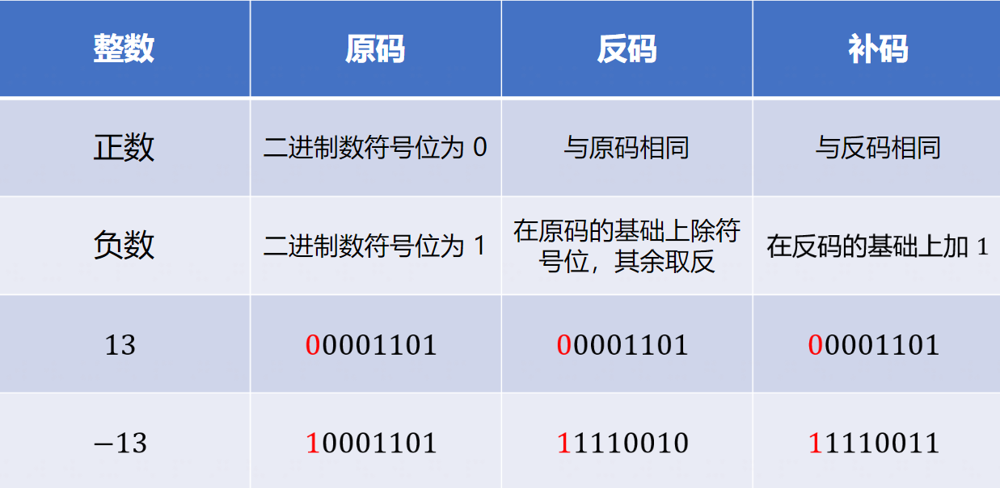
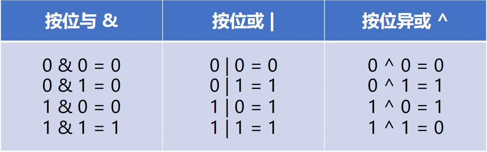
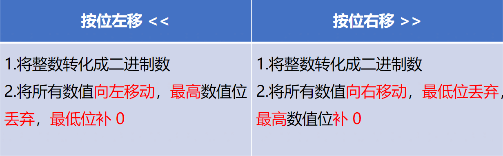

# C++课程

## 字符(串):
- 定义格式
```c++
char 变量名 = '字'       // 字符 单引号
string 变量名 = "字符串" //字符串 双引号
```
- 特殊输入
```c++
getline(cin, 变量名); // 按整行分不是按空格分
```
- 函数:

|函数名|作用|
|:-:|:-:|
|.size()/.length()|返回字符串长度|
|.empty()|判断字符串是否为空|

## 运算:

### 除法(/):
- $\color{red}{不能除以0}$
- 无小数参与的除法只会输出整数
- 两个整数相除要输出小数要乘个1.0
- 除以并赋值 /=
### 乘法(*)
- 乘并赋值 *=
### 取余(%)
- $\color{red}{不能对0取余}$
- 取余并赋值 %=
### 加法(+)
- 加并赋值 +=
- 自增 ++
### 减法(-)
- 减并赋值 -=
- 自减-=

## 数组定义:

- 定义数组大小 **必须用 $\color{red}{常量}$**

## 二维数组:
### 定义:
- 数据类型 + 变量名[行数][列数];

- 数据类型 + 变量名[行数][列数] = {{数据}, {数据}, {数据}.....} 未填初始化为零;

- 数据类型 + 变量名[行数][列数] = {} 初始化为零;

### 遍历:
#### 全部:
``` c++
    for (行){
        for (列){
        }
     }
```

#### 对角线:
``` c++
    for (行){
        for (列){
            if (i == j || i + j == n + 1){

                }
            }
    }
```

## 常量:

### 性质:
- 不能改变常量内容

### 常量定义:
``` c++
const + 数据类型 + 常量名 = 值;
```
## 错误类型:
- PE错误: 格式错

- RE错误: 数组越界访问、栈溢出、除零错误等

## printf():

### 格式:

``` c++
printf("变量格式", 量);
```

### 变量格式:
``` c++
%d:整数

%f:浮点数, %.数字f, 数字:小数点保留几位

%e:以指数形式输出单、双精度实数

%c:输出单个字符

%s:输出字符串

%-:左对齐

% + 数字:右对齐占用宽度为数字
```
 
## 二进制:
### 转化$\color{red}{(注意符号位不要代入!!!!!)}$:

#### 8421法$\color{red}{(注意符号位不要代入!!!!!)}$:
##### 十进制转原码$\color{red}{(注意符号位不要代入!!!!!)}$:
1. 分解十进制数为$2^n$相加的格式
   
    例如$5 = 4 + 1 = 2^2 + 2^1$

    $2^{16}$ ~ $2^0$: $16384,8192,4096,2048,1024,512,256,128,64,32,16,8,4,2,1$
2. 反向代入$2^n$倒排列表一直代入到$1$,如果有$2^n$这个数就为1,否则为0 
   
    例如:

    5 转化为原码

    |$2^n$倒排|8| 4 | 2 | 1 |
    |:-:|:-:|:-:|:-:|:-:|
    |$2^n$相加的格式|0| 4 |0| 1 |
    |原码|0| 1 | 0 | 1 |

#### $\color{red}{负数}$原码转反码:$\color{red}{除符号位不变}$其它1变0, 0变1

#### $\color{red}{负数}$原码转补码:在反码的基础上$+1$



##### 原码转十进制$\color{red}{(注意符号位不要代入!!!!!)}$:
1. 列出$2^n$倒排列表和原码数,数一一对齐
2. 原码数为1的对应$2^n$倒排列表的数的和为该原码数的十进制数
   
例如0101的原码数:

|原码|0| 1 | 0 | 1 |
|:-:|:-:|:-:|:-:|:-:|
|$2^n$倒排|8| 4 | 2 | 1 |
|对应为1的数|0|4|0|1|
4 + 1 = 5

##### c++代码:
```c++
// 转二进制
bitset<位>{十进制数};
```
- 位只能为$2^n$

### 格式:
- 首位为***符号位***: 0为负, 1为正

- $2^n$位二进制数

- 8位例如: |符号位|000 1011


### 位运算:
#### 直接对整数在内存中的二进制位进行按位操作
- $\color{red}{优先级:左右移 > 按位}$
- 按位与     &
    - 两个位都为1时,结果才为1
- 按位或     |
  - 两个位都为0时,结果才为0
- 按位异或   ^
  - 两个位相同为0,相异为1
- 按位取反   ~
  - 0变1,1变0
- 左移(每左移一位,相当于该数乘以2)      <<
  - 各二进位全部左移若干位,高位丢弃,低位补0
- 右移(每右移一位,相当于该数除以2)      >>
  - 各二进位全部右移若干位,高位补0或符号位补齐




## 常用函数:
使用时需导入对应头文件,或直接使用<bits/stdc++.h>万能头文件

|格式|数学符号|含义|
|:-:|:-:|:-:|
|pow(a, b)|$a^b$|幂运算|
|pow(a, 0.5)|$\sqrt{a}$|平方运算|
|abs(a)|&#124;a&#124;|整数绝对值|
|fabs(a)|&#124;a&#124;|浮点数绝对值|
|ceil(a)|$\lceil{a}\rceil$|向上取整|
|floor(a)|$\lfloor{a}\rfloor$|向下取整|
|round(a)|$\lfloor{a + \frac{1}{2}}\rfloor$|四舍五入|
|max(a, b)|-|2值中较大的数|
|min(a, b)|-|2值中较小的数|
|stoi(a)|-|字符串转int|


## 函数:

### 格式:

```cpp
返回值类型 函数名(形参){
  函数体
  return 返回值;
}
```
#### 返回值类型:
- 和变量定义相同
- void无返回值

#### 函数名:
- 和定义变量名相同

#### 形参:
- 定义局部变量
- 不同变量用逗号隔开


#### 函数体:
- 函数内容

#### 返回值:
```c++
return 变量;
```
- 返回局部变量的值
- void类型函数无返回值

---------------------------------------------------------

## 常用技巧:
- n % 10; 取出最后一位
- m % 10; 砍掉最后一位
- 回文数算法:
```c++
bool H(int x){
    int t = 0, m = x;
    while (m > 0){
        t = t * 10 + m % 10;
        m = m / 10;
    }
    if (t == x) return 1;
    else return 0;
}
```

# 课件:
- [二维数组的应用(一).pdf](./课件/二维数组的应用(一).pdf)
- [二维数组(二).pdf](./课件/二维数组(二).pdf)
- [数学专题(二)](./课件/数学专题(二).pdf)